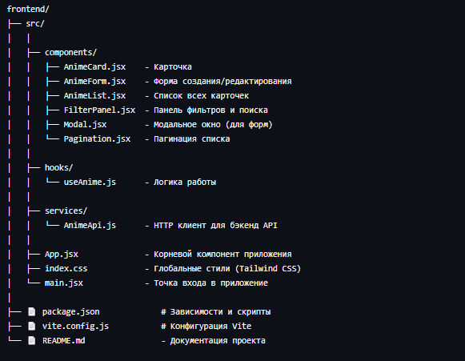
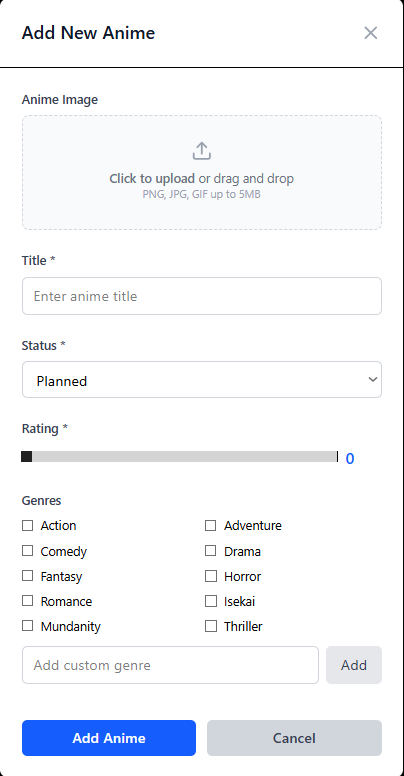
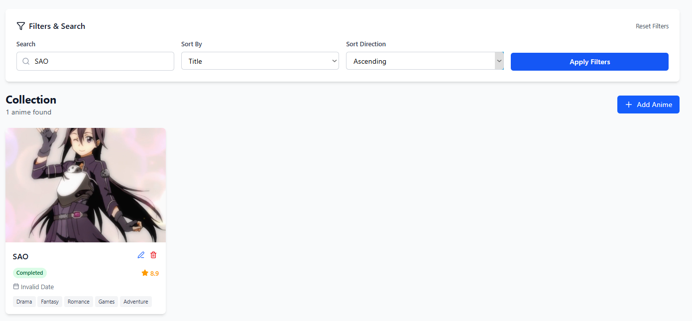
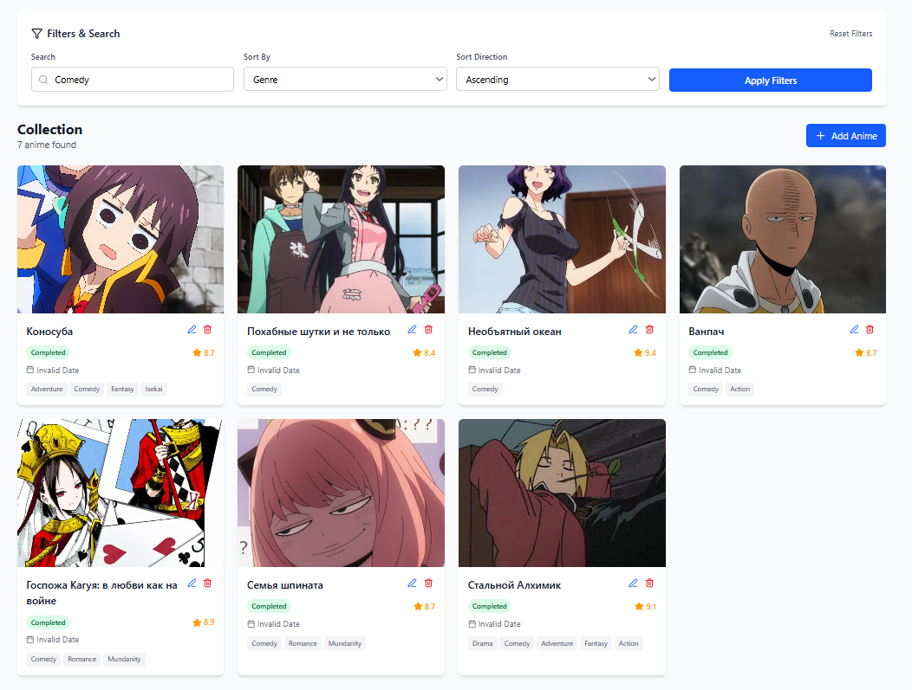
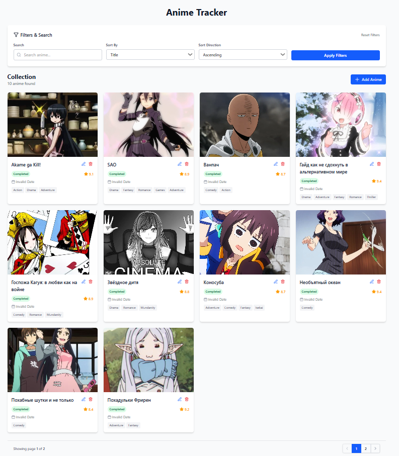
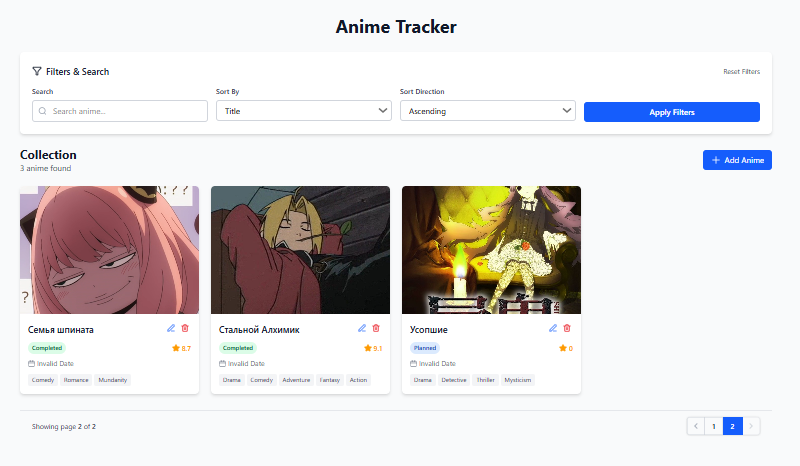

# anime-collection

Frontend приложение для управления тайтлами, разработанное на React с Tailwind CSS

## Структура

## Использование

- Окно при добавлении
  

- С использованием фильтров

- Без фильтров + пагинация
  

Приложение работает с бэкенд API: https://github.com/NikitosII/Anime_Collection.git
